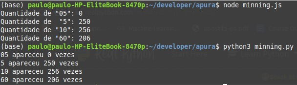

# Quick Start

0) Clone o projeto no seu ambiente

1) Dentro da pasta do projeto intale as dependências do projeto utilizando npm ou yarn:

```
$ npm install 
```
ou
```
$ yarn
```

Inicialmente o script index.js converte o arquive "file", que é uma base de dados SQL (SQLite) no arquivo megasena.csv . 

Os dois scripts fazem a leitura do arquivo megasena.csv e contabilizam a qantidade de vezes que os números 05, 5, 10 e 60 aparecem.


2) Para rodar a versão em .js:

```
$ node minning.js 
```

3) Para rodar a versão em .py:

```
$ python3 minning.py 
```

O Resultado de ambos os scripts podem ser vistos a seguir:


<div style=height:400px align="center" >
 